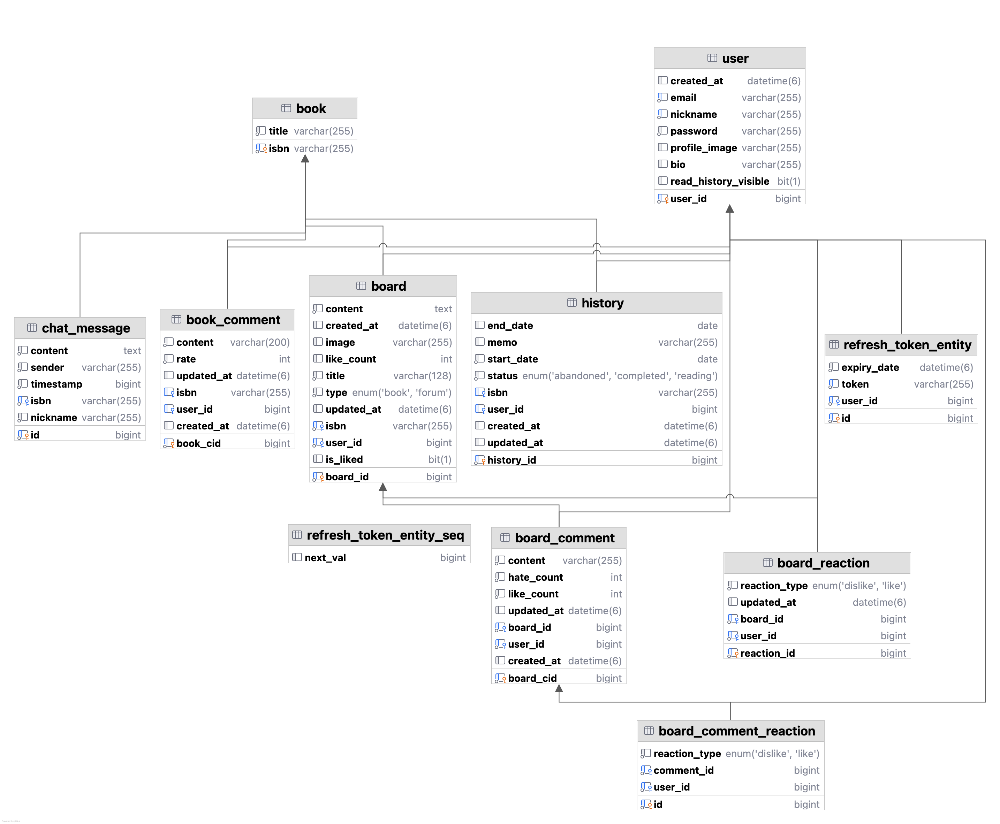

# 📚 쭉정이 - 도서 커뮤니티

> 쭉정이는 비어 있지만 그 빈 자리에 우리는 이야기와 사람을 채웁니다.<br> 겉만 번지르르한 것보다, 진짜 속 깊은 대화를 나누는 도서 커뮤니티, 그것이 바로 쭉정이입니다. </p>

<br>

## 📖 프로젝트 소개

<P>프로젝트 기간 : 2025.06.30. - 2025.07.09</P>
<p>프로젝트 목표 : 책을 좋아하는 사람들이 모여 정보 교류, 책 검색, 리뷰 작성, 기록 관리까지 한번에 할 수 있는 연결된 독서 경험 제공</p>

<br>

## 🔧 주요 기능

### 회원가입 & 로그인

- JWT 기반 인증 · 인가
- 이메일, 닉네임, 비밀번호 기반 회원가입
- 중복 및 형식 유효성 검사

### 홈 화면

- 고정 사이드바 + 스크롤 메인 콘텐츠
- 홈/커뮤니티/내 서재로 이동 가능한 메뉴
- 배너 슬라이드 (자동 + 수동)
- 책 검색, 인기글, 베스트셀러 리스트 제공(알라딘, 카카오 API)

### 도서

- 알라딘 API를 활용한 실시간 베스트셀러
- 카카오 API를 활용한 책 검색 및 상세 정보
- 별점과 댓글을 통한 책 리뷰
- 별점 시각화를 통한 사용자 반응 확인

### 커뮤니티

- 책 관련 게시글 작성 및 목록 확인
- 게시글 좋아요/싫어요 기능 및 상태 유지
- 책 이미지 클릭 시 해당 책 상세 페이지 이동
- 댓글에 좋아요/싫어요 반응 가능

### 일정 관리

- FullCalendar를 활용한 일정 조회/등록/수정/삭제
- 읽은 책 체크 표시 및 색상 반영
- 달력 & 내 서재 연동
- 선택한 월에 따른 일정 내역 반환

### 식시간 채팅

- WebSocket 기반 실시간 채팅
- 우측 하단 버튼 클릭 시 채팅 팝업
- 실시간 메시지 송수신
- 유저 닉네임, 시간, 날짜별 구분 표시

### UI/UX

- 반응형 디자인
- 화면 크기에 따라 레이아웃 자동 전환(모바일 가능)
- 탭 자동 전환 기능
- 페이지네이션

<br>

## 🎥 시연 영상

[](https://youtu.be/VS7GuLyoDPI)
<br>
[👉 쭉정이 시연 영상](https://youtu.be/VS7GuLyoDPI)

<br>

## 🧑‍💻 팀원 소개

| **이름** | **역할**  |
| :------: | :-------: |
|  김세민  | 팀장 & FE |
|  송창용  |    BE     |
|  김대환  |    BE     |
|  이지수  |  BE, FE   |

<br>

## ⚙️ 기술 스택

<table>
    <tr>
      <th>분류</th>
      <th>기술 스택</th>
    </tr>
    <tr>
      <td>프론트엔드</td>
      <td>
        
      </td>
    </tr>
    <tr>
      <td>백엔드</td>
      <td>
        
      </td>
    </tr>
    <tr>
      <td>인프라</td>
      <td>
        
      </td>
    </tr>
    <tr>
        <td>협업 툴</td>
        <td>
            
        </td>
    </tr>
</table>

<br>

## 📄 문서 자료

- [발표 자료](../asset/쭉정이.pdf)
- [Figma](https://www.figma.com/design/s9i5oUGmYLnJWqrekHpuKB/Untitled?node-id=0-1&m=dev&t=J3glVbbvJxLhpsgh-1)
- [ERD](https://www.erdcloud.com/d/k4qfHdxnWevehPYQo)
  

<br>

## 📂 폴더 구조

### FE

```
📦src
 ┣ 📂api
 ┃ ┣ 📜aladin.js
 ┃ ┣ 📜auth.js
 ┃ ┣ 📜axios.js
 ┃ ┣ 📜index.js
 ┃ ┗ 📜kakao.js
 ┣ 📂components
 ┃ ┣ 📂common
 ┃ ┃ ┣ 📜BaseButton.vue
 ┃ ┃ ┣ 📜BookSearch.vue
 ┃ ┃ ┣ 📜ChatFloating.vue
 ┃ ┃ ┣ 📜Comment.vue
 ┃ ┃ ┣ 📜History.vue
 ┃ ┃ ┣ 📜SearchBar.vue
 ┃ ┃ ┗ 📜Sidebar.vue
 ┃ ┣ 📂community
 ┃ ┃ ┗ 📜PostCard.vue
 ┃ ┣ 📂home
 ┃ ┃ ┣ 📜BannerSlider.vue
 ┃ ┃ ┣ 📜BestsellerList.vue
 ┃ ┃ ┗ 📜WeeklyPopularPosts.vue
 ┃ ┗ 📂search
 ┃ ┃ ┗ 📜BookList.vue
 ┣ 📂layouts
 ┃ ┗ 📜MainLayout.vue
 ┣ 📂pages
 ┃ ┣ 📜BookDetail.vue
 ┃ ┣ 📜Community.vue
 ┃ ┣ 📜Home.vue
 ┃ ┣ 📜LoginPage.vue
 ┃ ┣ 📜MyPage.vue
 ┃ ┣ 📜PostCreate.vue
 ┃ ┣ 📜PostDetail.vue
 ┃ ┣ 📜Search.vue
 ┃ ┗ 📜SignupPage.vue
 ┣ 📂router
 ┃ ┗ 📜index.js
 ┣ 📂stores
 ┃ ┗ 📜auth.js
```

### BE

```
📦book
 ┣ 📂config
 ┃ ┣ 📜BeanConfig.java
 ┃ ┣ 📜ChatSubscriptionInterceptor.java
 ┃ ┣ 📜JwtHandshakeInterceptor.java
 ┃ ┣ 📜SecurityConfig.java
 ┃ ┣ 📜SwaggerConfig.java
 ┃ ┣ 📜WebClientConfig.java
 ┃ ┣ 📜WebMvcCorsConfig.java
 ┃ ┗ 📜WebSocketConfig.java
 ┣ 📂constant
 ┃ ┣ 📜BoardType.java
 ┃ ┣ 📜BookSortType.java
 ┃ ┣ 📜HistoryStatus.java
 ┃ ┣ 📜MessageType.java
 ┃ ┗ 📜ReactionType.java
 ┣ 📂controller
 ┃ ┣ 📂board
 ┃ ┃ ┣ 📜BoardCommentController.java
 ┃ ┃ ┗ 📜BoardController.java
 ┃ ┣ 📂book
 ┃ ┃ ┣ 📜BookCommentController.java
 ┃ ┃ ┗ 📜BookController.java
 ┃ ┣ 📂chat
 ┃ ┃ ┗ 📜ChatController.java
 ┃ ┣ 📂user
 ┃ ┃ ┗ 📜UserController.java
 ┃ ┗ 📜AuthController.java
 ┣ 📂dto
 ┃ ┣ 📂auth
 ┃ ┃ ┣ 📜JwtResponseDto.java
 ┃ ┃ ┣ 📜LoginRequestDto.java
 ┃ ┃ ┣ 📜LoginResponseDto.java
 ┃ ┃ ┗ 📜SignupRequestDto.java
 ┃ ┣ 📂board
 ┃ ┃ ┣ 📜BoardLikeGroupResDto.java
 ┃ ┃ ┣ 📜BoardResDto.java
 ┃ ┃ ┣ 📜BoardWeeklyBestResDto.java
 ┃ ┃ ┗ 📜BoardWriteDto.java
 ┃ ┣ 📂book
 ┃ ┃ ┣ 📜BestSellerResDto.java
 ┃ ┃ ┣ 📜BookDetailResDto.java
 ┃ ┃ ┣ 📜BookHistoryReqDto.java
 ┃ ┃ ┣ 📜BookHistoryResDto.java
 ┃ ┃ ┣ 📜BookHistoryUpdateDto.java
 ┃ ┃ ┣ 📜BookRatingResDto.java
 ┃ ┃ ┗ 📜CalendarHistoryDto.java
 ┃ ┣ 📂chat
 ┃ ┃ ┗ 📜ChatMessageDto.java
 ┃ ┣ 📂comment
 ┃ ┃ ┣ 📜BoardCommentReactionResDto.java
 ┃ ┃ ┣ 📜BoardCommentResDto.java
 ┃ ┃ ┣ 📜BoardCommentWriteDto.java
 ┃ ┃ ┣ 📜BookCommentReqDto.java
 ┃ ┃ ┗ 📜BookCommentResDto.java
 ┃ ┣ 📂response
 ┃ ┃ ┗ 📜ApiResponseDto.java
 ┃ ┗ 📂user
 ┃ ┃ ┗ 📜UserProfileDto.java
 ┣ 📂entity
 ┃ ┣ 📜BoardCommentEntity.java
 ┃ ┣ 📜BoardCommentReactionEntity.java
 ┃ ┣ 📜BoardEntity.java
 ┃ ┣ 📜BoardReactionEntity.java
 ┃ ┣ 📜BookCommentEntity.java
 ┃ ┣ 📜BookEntity.java
 ┃ ┣ 📜ChatMessageEntity.java
 ┃ ┣ 📜HistoryEntity.java
 ┃ ┣ 📜RefreshTokenEntity.java
 ┃ ┗ 📜UserEntity.java
 ┣ 📂exception
 ┃ ┗ 📜ChatException.java
 ┣ 📂jwt
 ┃ ┣ 📜JwtAuthenticationFilter.java
 ┃ ┗ 📜JwtUtil.java
 ┣ 📂repository
 ┃ ┣ 📜BoardCommentReactionRepository.java
 ┃ ┣ 📜BoardCommentRepository.java
 ┃ ┣ 📜BoardReactionRepository.java
 ┃ ┣ 📜BoardRepository.java
 ┃ ┣ 📜BookCommentRepository.java
 ┃ ┣ 📜BookRepository.java
 ┃ ┣ 📜ChatMessageRepository.java
 ┃ ┣ 📜HistoryRepository.java
 ┃ ┣ 📜RefreshTokenRepository.java
 ┃ ┗ 📜UserRepository.java
 ┣ 📂service
 ┃ ┣ 📜BoardCommentReactionService.java
 ┃ ┣ 📜BoardCommentService.java
 ┃ ┣ 📜BoardReactionService.java
 ┃ ┣ 📜BoardService.java
 ┃ ┣ 📜BookCommentService.java
 ┃ ┣ 📜BookService.java
 ┃ ┣ 📜ChatService.java
 ┃ ┣ 📜CustomDetailsService.java
 ┃ ┣ 📜RefreshTokenService.java
 ┃ ┗ 📜UserService.java
 ┣ 📂util
 ┃ ┗ 📜UserUtil.java
 ┗ 📜BookApplication.java
```

---
